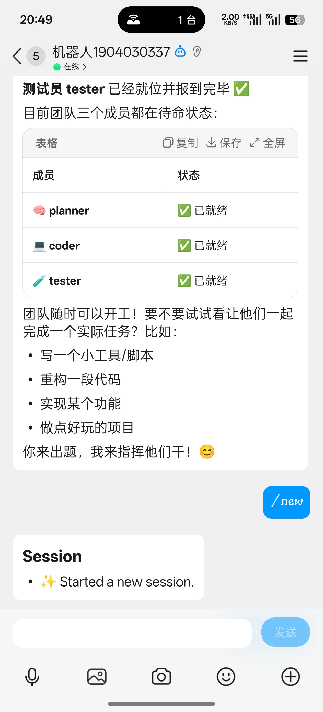
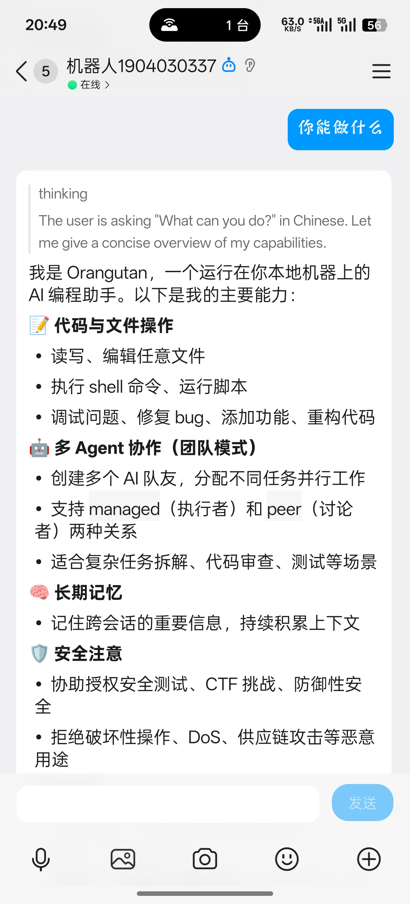
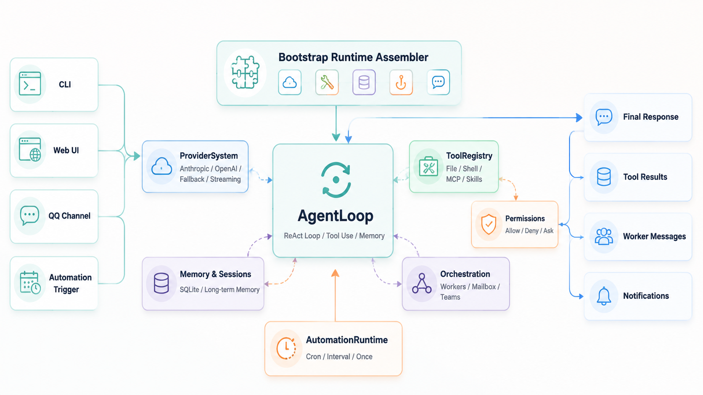
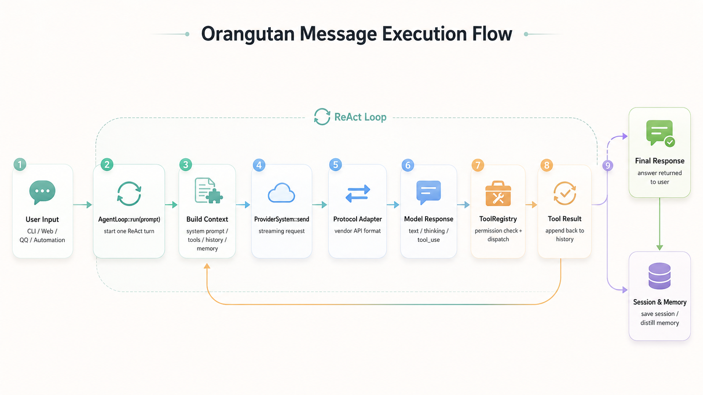

# Orangutan

Orangutan 是一个用 **C++23** 实现的本地 AI Agent 运行时。它不是简单的“套壳聊天机器人”，而是把 LLM ReAct 循环、工具调用、权限控制、多模型适配、长期记忆、多 Agent 协作、自动化任务、Web/CLI/QQ 多入口整合到一个单二进制程序里。

## 项目背景

项目目标是做一个能真正接入本地工作流的 Agent：

- 可以在命令行、Web 页面或 QQ 聊天里使用；
- 能读写文件、执行命令、调用脚本、接入 MCP 工具；
- 对高风险操作有权限判断和人工确认；
- 能保存会话、沉淀长期记忆，并在后续对话中召回；
- 能启动多个专门 Agent，让它们通过 mailbox 和 team 机制协作；
- 能通过 cron/interval/once 任务定时触发，让 Agent 主动执行工作。

因此，Orangutan 的重点不是“调用某个模型 API”，而是实现一个可扩展、可持久化、可控制风险的本地 Agent runtime。

## 运行效果

当前项目支持 QQ 外部聊天入口，典型运行场景包括：

| 场景 | 说明 |
|------|------|
| QQ 会话入口 | 用户可以直接在 QQ 里向机器人提问，机器人返回 thinking、能力说明和最终回答。 |
| 多 Agent 团队 | planner、coder、tester 等成员可以进入待命状态，由主 Agent 调度协作完成任务。 |

<p align="center">
  
  
</p>

## 核心特性

| 能力 | 实现重点 | 代码入口 |
|------|----------|----------|
| ReAct Agent Loop | 多轮“模型响应 -> 工具调用 -> 工具结果 -> 继续推理”循环，支持 streaming、thinking、工具重复检测、历史压缩和记忆蒸馏。 | `src/agent/agent-loop.cpp` |
| 多模型 Provider | 统一 `ProviderRequest` / `ProviderResult`，将 Anthropic Messages、OpenAI Chat Completions、OpenAI Responses 拆成协议适配层，并在执行层处理重试、fallback 和用量统计。 | `src/providers/` |
| 工具注册与分发 | `ToolRegistry` 管理工具定义、权限检查、执行函数、富文本结果和 deferred tool discovery。内置文件、shell、MCP、memory、orchestration、automation、skill、script 等工具。 | `src/tools/` |
| 权限系统 | allow/deny/ask 规则、命令安全检查、人工审批提示和签名 replay，避免 Agent 直接执行危险操作。 | `src/permissions/` |
| 会话与长期记忆 | SQLite 持久化 session history 和 memory，支持 runtime scope、搜索、衰减/保留策略，以及可选 `MEMORY.md` 镜像。 | `src/storage/`, `src/memory/` |
| 多 Agent 编排 | `OrchestrationManager` 负责 worker 生命周期、并发上限、stop token、通知、mailbox 消息和 team membership。 | `src/orchestration/` |
| 自动化任务 | cron / interval / once 触发器，SQLite 保存任务状态，runtime 在触发时创建新的 Agent 执行上下文。 | `src/automation/`, `src/heartbeat/` |
| 多入口运行 | CLI REPL、single-shot、HTTP Web UI + SSE、QQ channel 共享同一套 Agent runtime 组装逻辑。 | `src/cli/`, `src/web/`, `src/channel/` |
| 配置与密钥保护 | JSON 配置支持 profile/agent/permission/channel，API key 等敏感字段可加密落盘。 | `src/config/` |

## 系统架构

`main.cpp` 只负责调用 `orangutan::bootstrap::run(argc, argv)`。真正的运行时装配集中在 `src/bootstrap/`，它会解析 CLI 参数、加载配置、初始化 SQLite store、构造 provider/tool/memory/hook/channel/automation/orchestration 等组件，然后启动对应入口。

<p align="center">
  
</p>

一次普通消息的执行流程：

<p align="center">
  
</p>

## 核心实现细节

### 1. Agent Loop：控制一次任务的完整生命周期

`AgentLoop` 是项目的核心。它维护 conversation history，每轮调用 provider，解析模型返回的 `Content`，把 `ToolUse` 派发给工具系统，再把 `ToolResult` 作为 user message 写回历史。

实现中比较关键的点：

- `MAX_ITERATIONS` 限制单次任务的推理/工具循环次数，避免无限运行；
- 对 `max_tokens` 截断结果做 continuation 处理；
- 对重复工具调用做 warning/abort，避免模型卡在同一个动作；
- 单轮开始时先渲染 prompt memory section，避免每次迭代重复检索同一份记忆；
- skills 和 deferred tools 在迭代间动态刷新，保证运行中发现的能力能进入后续提示词。

相关文件：`src/agent/agent-loop.cpp`, `src/agent/tool-executor.cpp`, `src/prompt/`

### 2. Provider：把模型差异限制在协议适配层

不同模型 API 的请求/响应格式差异很大，尤其是 tool use、streaming、thinking、stop reason 等字段。Orangutan 用统一的 `ProviderRequest`、`ProviderResult` 和 `ProviderEvent` 把上层 Agent 与厂商协议隔离。

Provider 分三层：

- `transport/`：libcurl HTTP、SSE 解析、curl handle/header RAII 封装；
- `protocols/`：Anthropic Messages、OpenAI Chat Completions、OpenAI Responses 协议适配；
- `execution/`：重试、fallback model 切换、active target、usage stats 聚合。

相关文件：`src/providers/provider.hpp`, `src/providers/protocols/`, `src/providers/execution/`

### 3. Tool Registry：让工具能力可注册、可审计、可控制

工具不是散落在 Agent 里的 if/else，而是统一注册到 `ToolRegistry`。每个工具携带：

- 给模型看的 `ToolDef` schema；
- 权限检查函数；
- 普通文本或富文本执行结果；
- read-only / deferred 等元信息。

这让文件操作、shell、MCP、memory、automation、orchestration、skill 等工具可以共用同一套分发和权限逻辑。新增工具时只需要注册定义、权限和执行函数，不需要改 Agent loop。

相关文件：`src/tools/registry/tool-registry.hpp`, `src/tools/register.cpp`, `src/tools/*/`

### 4. 多 Agent 编排：从单助手变成团队运行时

Orangutan 的 orchestration 不是简单开多个进程，而是有统一的生命周期管理：

- 主 Agent 可以通过工具 spawn worker；
- worker 拥有独立 runtime identity、session 和 memory scope；
- `AgentMailbox` 支持按 run_id、agent name 或 team broadcast 发送消息；
- `TeamManager` 管理 team membership；
- `max_concurrent_agents` 控制并发上限；
- stop/shutdown 逻辑集中在 `OrchestrationManager`。

相关文件：`src/orchestration/`, `src/tools/orchestration/`, `src/bootstrap/agent-loop-teammate.*`

### 5. 自动化：让 Agent 主动运行

自动化模块把“什么时候触发”和“触发后如何运行 Agent”分开：

- `Automation` model 表达任务定义；
- trigger 支持 cron、interval、once；
- repository 用 SQLite 保存任务、下一次触发时间、运行记录和状态；
- runtime 到期后通过 executor callback 组装一个新的 Agent runtime；
- category 机制允许 heartbeat 这类任务自定义结果处理。

相关文件：`src/automation/`, `src/bootstrap/automation-executor.*`, `src/heartbeat/`

## 技术难点与工程取舍

| 难点 | 处理方式 |
|------|----------|
| LLM API 差异大 | 上层只看统一 provider 类型，厂商差异封装在 protocol adapter。 |
| 工具调用有安全风险 | 工具执行前走权限规则和 safety checks，高风险命令进入 ask/deny 流程。 |
| 多入口共享运行逻辑 | CLI、Web、QQ、automation 都走 bootstrap runtime assembler，不复制 Agent 构建代码。 |
| 多 Agent 状态隔离 | 通过 runtime identity、session store、memory scope、mailbox/team store 区分不同运行实例。 |
| 长会话上下文膨胀 | 支持 history compaction、session memory distillation，并将 prompt memory 按用户输入预渲染。 |
| 定时任务可靠性 | 任务定义和调度状态落 SQLite，重启后可恢复；trigger 计算与执行回调解耦。 |
| C++ 工程复杂度 | 用 xmake 管理构建，Catch2 拆分测试桶，核心边界以小模块组织，尽量用 `std::expected` 表达可恢复错误。 |

## 快速运行

### 依赖

- C++23 编译器，建议 GCC 14+ 或 Clang 18+
- [xmake](https://xmake.io/)
- SQLite3、libcurl 等依赖由 xmake 按 `xmake-requires.lock` 拉取

### 构建

```bash
# 配置 release 模式
xmake f -m release

# 只构建主程序
xmake build orangutan

# 构建全部目标，耗时更长
xmake
```

### 配置

复制配置样例到默认配置路径，并填写 provider、agent、permission、channel 等配置：

```bash
mkdir -p ~/.orangutan
cp config.example.json ~/.orangutan/config.json
```

配置中可以使用环境变量引用 API key，例如 `${ANTHROPIC_API_KEY}`。需要加密配置中的敏感字段时：

```bash
xmake run orangutan -- --protect-config-secrets --config-password "<password>"
```

### 启动

```bash
# 交互式 CLI
xmake run orangutan -- --cli

# 单次提问
xmake run orangutan -- --cli --message "解释一下这个项目的架构"

# Web UI，默认端口 18080
xmake run orangutan -- --web --port 18080

# 启动已配置的 QQ 等 channel adapter
xmake run orangutan -- --channel
```

## 测试与质量

测试使用 Catch2。`tests/` 下每个目录对应一个 `test-*` 目标，方便按模块快速验证。

```bash
# 全量测试
xmake test

# 只跑 agent 测试桶
xmake run test-agent

# 只跑 automation 测试桶
xmake run test-automation

# 按 Catch2 用例名或 tag 过滤
xmake run test-agent "test case name"
xmake run test-agent "[tag]"
```

项目使用 clang-format、clang-tidy 和 clangd；`compile_commands.json` 会在构建时自动生成。

## 代码导览

```text
src/
├── bootstrap/      # 程序入口和运行时装配
├── agent/          # ReAct AgentLoop、工具执行、历史压缩、记忆蒸馏
├── providers/      # LLM transport / protocol / execution
├── tools/          # 工具注册、文件/shell/MCP/自动化/编排等工具
├── permissions/    # 权限规则、审批签名、安全检查
├── orchestration/  # 多 Agent 生命周期、mailbox、team
├── automation/     # cron/interval/once 自动化任务
├── memory/         # 长期记忆和 runtime memory scope
├── storage/        # SQLite session store 和通用 SQLite 封装
├── config/         # JSON 配置、环境变量、密钥保护
├── cli/            # REPL、single-shot、slash command
├── web/            # HTTP routes、SSE、Web UI 后端
├── channel/        # QQ 等外部聊天入口
├── skills/         # skill loader
├── hooks/          # tool/message 生命周期 hook
└── utils/          # expected、sender、task pool、字符串/时间等工具
```

更多开发约束和架构说明见 [AGENTS.md](AGENTS.md)。

## License

Proprietary. All rights reserved.
