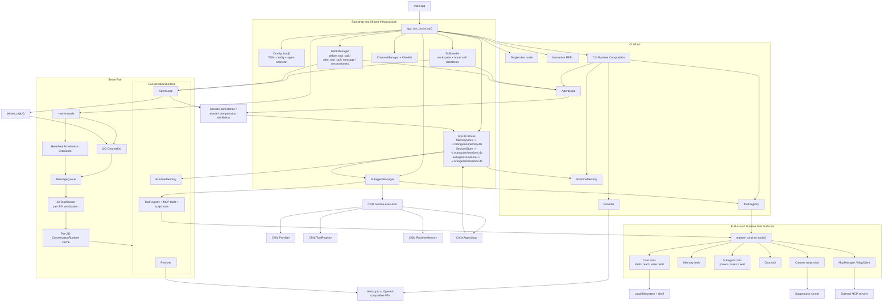

# Orangutan Project Exploration

Generated on 2026-03-18.

This document summarizes the current implementation of `orangutan`, reconstructs the runtime architecture from the source tree, and benchmarks the project against the upstream OpenClaw project as documented in its public README and docs on 2026-03-18.

## Scope and Method

- Repository analysis was done from the current workspace using `agent-query` plus targeted source reads.
- Codebase size at the time of analysis:
  - `src/`: 98 files
  - `tests/`: 46 files
  - Approx. 22.3k lines total, overwhelmingly C++
- Benchmark references were taken from the public OpenClaw README and docs:
  - OpenClaw README
  - OpenClaw Architecture docs
  - OpenClaw Features docs
  - OpenClaw Sandbox docs
  - OpenClaw Skills docs

## Executive Summary

`orangutan` is already more than a minimal CLI LLM wrapper. It is a single-binary, local-first C++ agent runtime with:

- CLI REPL and single-shot execution
- optional long-running `--serve` mode
- QQ channel integration
- persistent sessions
- scoped long-term memory with mirror and journal support
- hook execution
- MCP client support
- user-defined script tools
- cron/heartbeat jobs
- basic subagent delegation

Architecturally, it is cleanly split into:

- `app`: process bootstrap and user-facing flows
- `core`: provider abstractions, shared types, tool registry
- `features`: agent loop, channels, tools, memory, hooks, subagents, skills, cron/heartbeat
- `infra`: config, subprocesses, SQLite-backed persistence

The main conclusion is that `orangutan` is currently a focused embedded runtime, while OpenClaw is a broader agent platform with a gateway/control-plane model, more surfaces, stricter security posture, and a much larger extension/deployment story. The gap is not mostly "missing classes"; it is mostly "missing platform layers".

## Current Architecture Diagram

## How the System Actually Works

### 1. Process bootstrap

The entrypoint is intentionally thin:

- `src/main.cpp` only calls `orangutan::app::run_bootstrap`
- `src/app/bootstrap.cpp` is the real application composition root

`run_bootstrap()` performs the following:

1. Parse CLI arguments with `CLI11`
2. Load config from TOML
3. Resolve the selected agent profile and workspace
4. Resolve API credentials
5. Construct persistence stores
6. Build runtime config for all configured agents
7. Construct `SubagentManager`
8. Build the CLI runtime:
   - provider
   - `ToolRegistry`
   - `RuntimeMemory`
   - runtime tools
   - `SkillLoader`
   - `HookManager`
   - `AgentLoop`
9. Dispatch into one of three modes:
   - single-shot
   - REPL
   - serve mode

This means the project has one clear composition root, which is good. It also means `bootstrap.cpp` is one of the central architectural files and is currently doing a lot of orchestration work.

### 2. Provider layer

The provider abstraction is deliberately small:

- `Provider::chat(...)`
- `Provider::chat_stream(...)`
- `Provider::name()`

Current implementations:

- `AnthropicProvider`
- `OpenAiProvider`

Important details:

- the OpenAI provider is used as the compatibility path for OpenAI-style backends, including local or third-party compatible APIs
- streaming is normalized through SSE parsing and content-block/tool-call accumulation
- tool calls are converted into the project’s internal `ToolUseBlock` / `ToolResultBlock` representation

This is a reasonable foundation. The provider abstraction is good enough for the current scope, but it is still a thin transport adapter, not a broader model capability layer.

### 3. Agent loop

`src/features/agent/agent-loop.cpp` is the behavioral core of the system.

The loop currently handles:

- conversation history
- streaming responses
- tool call extraction
- tool execution
- hook dispatch
- loop detection on repeated tool calls
- max-token continuation
- history compression
- session memory distillation
- long-term memory injection into the system prompt

This is the strongest part of the current codebase. The project is not just "call an API, then maybe call a tool". It already contains real orchestration logic.

### 4. Runtime identity and scoping

One of the better design choices in the current implementation is the explicit runtime identity model:

- CLI runs derive a runtime key and memory/session scope from the selected agent
- channel runs derive a runtime key from `jid + agent`
- child runs derive identity from the parent caller plus child agent

This affects:

- workspace selection
- session persistence scope
- long-term memory scope
- subagent run ownership

This gives the system a real notion of isolated execution contexts, even though it is still inside a single process.

### 5. Memory system

The memory subsystem is larger than it first appears.

Storage:

- `MemoryStore` is backed by SQLite
- search is lexical with ranking plus optional FTS support
- records carry category, source, importance, access count, and scope

Runtime behavior:

- `RuntimeMemory` wraps `MemoryStore` with a runtime scope
- prompt-time retrieval injects a bounded `<relevant-memories>` block
- auto-capture extracts candidate durable facts from user and assistant text
- session distillation converts full sessions into durable memories plus a journal summary
- mirror support can write a workspace snapshot file and journal entries

This is one of the biggest differentiators inside the current project. The memory model is already opinionated and persistent, not just an in-memory scratchpad.

### 6. Tools and extension points

`ToolRegistry` is the execution hub for all tool calls.

Current built-in tool families:

- core filesystem/process tools:
  - `shell`
  - `read`
  - `write`
  - `edit`
- memory tools
- subagent tools
- cron management tool

Runtime-loaded extensions:

- custom script tools from config
- MCP servers, exposed as dynamically registered tools

Additional extension surfaces:

- skills via `SKILL.md`
- executable hooks

This is already a meaningful extension model, but it is still a runtime-local model, not yet a formal plugin platform.

### 7. Serve mode and channel architecture

The `--serve` path is structurally separate from the CLI path.

Key parts:

- `ChannelManager` owns configured channels
- `MessageQueue` buffers inbound work
- `JidTaskRunner` serializes work per JID while allowing cross-JID concurrency
- `ensure_runtime_for_jid(...)` lazily creates a `ConversationRuntime` for each active conversation scope
- each `ConversationRuntime` owns its own:
  - provider
  - tool registry
  - MCP manager
  - runtime memory
  - agent loop

This is a good design for chat/message surfaces. It prevents different conversations from sharing agent history accidentally while still sharing storage and control-plane objects where appropriate.

Current channel support in first-party code:

- QQ only
- heartbeat jobs feeding into the same queue as synthetic inbound messages

### 8. Sessions and persistence

`SessionStore` persists:

- sessions
- message histories
- JID-to-session bindings

`SubagentRunStore` persists:

- parent/child run metadata
- status transitions
- summaries and outputs

Persistence is simple and understandable. SQLite is doing the right amount of work here.

## Current Strengths

### Architectural strengths

- Clear module boundaries between app/core/features/infra
- One obvious composition root
- Good runtime scoping model for CLI, channel, and child-agent flows
- Reasonable use of SQLite rather than ad hoc flat-file state
- Clean provider abstraction
- Strong use of testable leaf modules

### Product strengths already present

- long-term memory is real, persistent, and scoped
- session restore/compress/distill flows are already implemented
- serve mode is not fake; it has a proper queue and per-conversation runtime cache
- subagent support is real, not just a prompt trick
- MCP support exists now
- skills and hooks already create a customization surface

### Engineering strengths

- substantial test surface for a project of this size
- migration code exists for legacy storage formats
- credential scrubbing exists for tool output
- hook lifecycle and session lifecycle are explicit

## Gaps and Shortcomings in the Current Implementation

This section is based on direct code inspection and, where noted, comparison with OpenClaw.

### 1. The project is still a runtime, not yet a platform

Compared with OpenClaw’s gateway/client architecture, `orangutan` is currently a single-binary embedded runtime.

What is missing:

- no networked gateway/control-plane layer
- no official remote API for external clients
- no desktop/web control surface
- no cluster/node topology
- no shared service boundary between channel ingress, agent execution, and operator UI

This is the single largest architectural gap.

### 2. Security is materially weaker than OpenClaw’s model

OpenClaw explicitly documents a secure-by-default posture and sandboxing options. In contrast, the current `orangutan` tool surface is permissive:

- `shell` runs `/bin/sh -c` directly
- `read`, `write`, and `edit` accept absolute paths
- `resolve_tool_path(...)` only prepends the workspace for relative paths

That means the current tool layer is local-first and convenient, but not safe enough for broader multi-channel or untrusted-user deployment.

Related issue:

- `Config::allowed_tools` / `denied_tools` are parsed and tested, but I found no enforcement call site for `Config::is_tool_allowed(...)` outside the config implementation and config tests

So there is a partially designed tool permission surface that is not currently wired into execution.

### 3. Several config knobs appear defined but not actually enforced

The config schema exposes:

- `temperature`
- `max_iterations`
- `max_tokens`

However, in the current runtime wiring:

- `AgentLoop` uses a hardcoded `max_iterations = 20`
- provider calls are made without passing config-specific `max_tokens`
- no provider request body includes `temperature`

This means the config contract is ahead of the implementation. Users can set these values, but the runtime does not appear to honor them today.

### 4. Channel support is narrow

The first-party messaging/channel implementation is effectively:

- CLI
- QQ
- heartbeat jobs as synthetic messages

That is useful, but it is far from OpenClaw’s broader surface area. There is no first-party evidence of:

- Slack
- Discord
- Telegram
- Matrix
- web chat
- browser-based operator inbox
- webhook/client SDK surfaces

### 5. The extension model is practical but still limited

Today the project supports extension through:

- skills
- hooks
- script tools
- MCP servers

That is good, but it is not yet equivalent to a rich plugin ecosystem with lifecycle management, packaging, discovery, permissions, and operator UX. OpenClaw’s public material is much further along here.

### 6. Multi-agent support is real but still minimal

What exists:

- `subagent_spawn`
- `subagent_status`
- `subagent_wait`
- persistent subagent run records
- child runtime creation with isolated identity/scope

What is still limited:

- child runs cannot spawn further children
- there is no richer agent-to-agent session protocol or control plane
- no distributed workers or remote nodes
- no advanced routing/orchestration policies beyond "allowed child agents"

This is a good first generation, not yet a mature multi-agent platform.

### 7. Observability and operations are still thin

The current project has logging and persistence, but I found no broader operational layer such as:

- dashboard
- health/diagnostic endpoints
- usage/cost telemetry
- rate-limit or retry/backoff policy management
- admin tooling for inspecting live runtimes
- packaged deployment story beyond building the binary

That matters more once the system is used continuously in `--serve` mode.

### 8. Memory is strong, but retrieval is still local and lexical

The current memory implementation is solid, but it is still:

- SQLite-backed
- FTS/lexical/ranking-based
- local to the runtime/store

What is not present yet:

- external knowledge sources
- vector/semantic retrieval pipeline
- shared/global organizational memory layer
- memory governance or admin tooling

This is not necessarily a flaw for a local-first agent, but it is a limitation compared with a broader platform direction.

## Benchmark Against OpenClaw

The table below reflects the current `orangutan` codebase versus OpenClaw’s public platform positioning as documented on 2026-03-18.

| Area | Orangutan today | OpenClaw benchmark | Gap assessment |
| --- | --- | --- | --- |
| Core shape | Single local C++ binary | Gateway-centric agent platform | Large gap |
| Primary surfaces | CLI, QQ, heartbeat | Desktop, web chat, channels, gateway clients, server deploys | Large gap |
| Tool system | Built-ins, scripts, MCP, skills, hooks | Broader managed ecosystem, nodes, browser/canvas/system surfaces | Medium to large gap |
| Security | Local convenience, weak isolation, unenforced tool ACL config | Secure-by-default with sandbox story | Large gap |
| Multi-agent | Spawn/status/wait child runs | Broader multi-agent routing/platform features | Medium gap |
| Persistence | SQLite sessions, memory, subagent runs | More platformized control/data plane | Medium gap |
| Memory | Scoped, persistent, mirrored, distilled | Not directly weaker, but less platformized | Moderate gap |
| Testing | Strong for current size | Unknown from public docs, but Orangutan is already respectable here | Relative strength |

## What OpenClaw Has That Orangutan Does Not Yet Have

Based on OpenClaw’s public docs and README, the main missing layers are:

### 1. Gateway and client architecture

OpenClaw presents a dedicated gateway architecture with clients connecting through a central service boundary. `orangutan` currently does everything in-process.

### 2. Stronger sandbox and permissions model

OpenClaw documents sandboxing and a secure-by-default posture. `orangutan` currently trusts the runtime and host machine far more aggressively.

### 3. Broader interaction surfaces

OpenClaw publicly emphasizes desktop, browser/webchat, channels, and agent-to-agent or routed experiences. `orangutan` is mainly CLI plus QQ serve mode.

### 4. Broader extension ecosystem

OpenClaw’s public material describes a more productized ecosystem for tools/skills/extensions. `orangutan` has the primitive surfaces, but not yet the ecosystem layer.

### 5. More platform and operator features

OpenClaw has more evidence of operational polish: deployment modes, gateway roles, sandbox docs, architecture docs, and productized user surfaces. `orangutan` is still closer to a developer runtime.

## Recommended Development Direction

The best path is not to copy OpenClaw feature-for-feature immediately. The better strategy is to harden the current runtime first, then add platform layers.

### Phase 1: Harden the current core

Highest priority items:

1. Enforce tool permissions
   - wire `allowed_tools` / `denied_tools` into actual tool registration or execution
2. Add real filesystem and process sandbox controls
   - workspace jail
   - absolute-path restrictions
   - optional deny-by-default shell mode
3. Honor config values already exposed
   - `temperature`
   - `max_iterations`
   - `max_tokens`
4. Add provider retry/backoff and better error handling
5. Add runtime introspection
   - active conversations
   - active subagent runs
   - registered tools
   - connected channels/MCP servers

This phase turns the current code from "good internal runtime" into "safe and trustworthy local platform kernel".

### Phase 2: Make serve mode a first-class service

Recommended next:

1. Extract a stable control/API layer around serve mode
2. Add admin/status endpoints or a local control socket
3. Add more channels only after permissions/sandboxing are stronger
4. Add structured observability for:
   - per-runtime state
   - tool calls
   - provider latency/errors
   - queue depth

### Phase 3: Expand extension and interaction surfaces

After the core is hardened:

1. formalize a plugin or package model beyond raw scripts/hooks
2. add managed skill discovery/install/update
3. add browser/web tooling or richer MCP-based UI integration
4. make the subagent system richer:
   - non-blocking orchestration patterns
   - better run inspection
   - optional nested delegation policies

### Phase 4: Move toward an OpenClaw-like platform shape

If the long-term goal is to compete with or benchmark closely against OpenClaw, the eventual steps are:

1. introduce a gateway/control-plane service boundary
2. separate ingress, execution, and operator surfaces
3. support more than one first-party user/channel surface
4. enforce execution isolation for untrusted contexts
5. package the system as an operational platform, not just a binary

## Bottom Line

`orangutan` already has a real architecture. It is not a toy and it is not just a thin model wrapper. Its strongest current assets are:

- a good agent loop
- scoped persistent memory
- clean session persistence
- real channel runtime composition
- MCP/script/hook/skill extensibility
- practical subagent support

Its main weakness, especially relative to OpenClaw, is not code quality. It is product and platform breadth:

- weaker security boundary
- fewer surfaces
- no gateway/control plane
- limited channel ecosystem
- limited operator tooling
- config surface partly ahead of actual runtime behavior

The immediate recommendation is to treat the current repository as a solid local agent kernel and harden it before broadening it.

## Source Files Most Central to the Current Architecture

If you want to continue exploration, these are the highest-value files:

- `src/app/bootstrap.cpp`
- `src/app/channel-serve.cpp`
- `src/features/agent/agent-loop.cpp`
- `src/features/memory/runtime-memory.cpp`
- `src/features/memory/memory.cpp`
- `src/features/subagent/subagent-manager.cpp`
- `src/features/tools/runtime/runtime-loader.cpp`
- `src/features/tools/mcp/client.cpp`
- `src/infra/config/config.cpp`
- `src/infra/storage/session-store.cpp`
- `src/infra/storage/subagent-run-store.cpp`

## External Benchmark Sources

- OpenClaw README: <https://github.com/clawdbot/clawdbot>
- Raw README snapshot used in this analysis: <https://raw.githubusercontent.com/clawdbot/clawdbot/main/README.md>
- OpenClaw Architecture docs: <https://docs.openclaw.ai/architecture>
- OpenClaw Features docs: <https://docs.openclaw.ai/features>
- OpenClaw Sandbox docs: <https://docs.openclaw.ai/core-concepts/sandbox>
- OpenClaw Skills docs: <https://docs.openclaw.ai/tools/skills>
